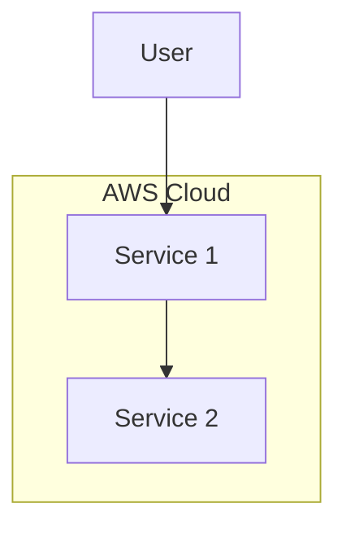
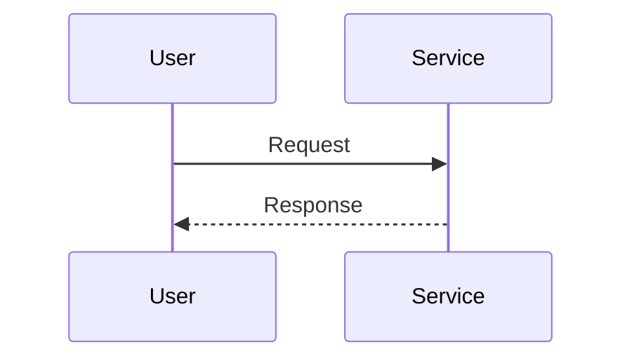
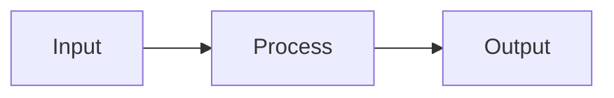

# InfraTales Repository Template

Use this template when creating new InfraTales projects.

## Required Structure

```
project-name/
├── README.md                    # InfraTales branded (see template below)
├── LICENSE                      # MIT License
├── CONTRIBUTING.md              # Contribution guidelines
├── SECURITY.md                  # Security policy
├── .gitignore                   # Language-appropriate ignores
├── .github/
│   └── workflows/
│       └── ci.yml               # CI workflow
├── docs/
│   ├── cost.md                  # Cost analysis in ₹
│   ├── security.md              # Security overview
│   ├── runbook.md               # Operations guide
│   └── troubleshooting.md       # Common issues
├── diagrams/
│   ├── architecture.mmd         # Architecture diagram
│   ├── sequence.mmd             # Sequence diagram
│   └── dataflow.mmd             # Data flow diagram
└── [infrastructure code]        # Terraform/CDK/CDKTF
```

---

## README Template

```markdown
# InfraTales | [Hook] – [Architecture Description]

**Production-ready reference architecture for [description].**

> **[Detailed tagline with key features]**

[](LICENSE)
[](CONTRIBUTING.md)
[](https://aws.amazon.com/)
[](https://www.terraform.io/)

## 🎯 Overview

[Brief description of what this project does]

## 🏗️ Architecture

[Architecture description with diagram reference]

## ✨ Features

- Feature 1
- Feature 2
- Feature 3

## 🚀 Quick Start

\`\`\`bash
# Clone
git clone https://github.com/InfraTales/project-name.git

# Deploy
cd project-name
terraform init
terraform apply
\`\`\`

## 📚 Documentation

- [Cost Analysis](docs/cost.md)
- [Security](docs/security.md)
- [Runbook](docs/runbook.md)
- [Troubleshooting](docs/troubleshooting.md)

## 🤝 Contributing

See [CONTRIBUTING.md](CONTRIBUTING.md) for guidelines.

## 📄 License

MIT License - see [LICENSE](LICENSE) for details.

---

<div align="center">
  <a href="https://infratales.com">Website</a> •
  <a href="https://infratales.com/projects">Projects</a> •
  <a href="https://infratales.com/premium">Premium</a> •
  <a href="https://infratales.com/newsletter">Newsletter</a>
</div>
```

---

## Cost.md Template

```markdown
# Cost Analysis (₹)

## Production Environment

| Service | Monthly Cost (₹) | Notes |
|---------|------------------|-------|
| Service 1 | ₹X,XXX–XX,XXX | Description |
| **Total** | **₹XX,XXX–XX,XXX** | |

## Cost Optimization

- Strategy 1
- Strategy 2
```

---

## Mermaid Diagram Templates

### architecture.mmd


### sequence.mmd


### dataflow.mmd


---

## Checklist for New Projects

- [ ] README follows InfraTales format
- [ ] LICENSE file (MIT)
- [ ] CONTRIBUTING.md
- [ ] SECURITY.md
- [ ] docs/cost.md with ₹ estimates
- [ ] docs/security.md
- [ ] docs/runbook.md
- [ ] docs/troubleshooting.md
- [ ] diagrams/architecture.mmd
- [ ] diagrams/sequence.mmd
- [ ] diagrams/dataflow.mmd
- [ ] .github/workflows/ci.yml
- [ ] Added to projects-registry.json
